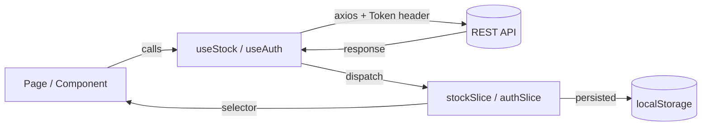
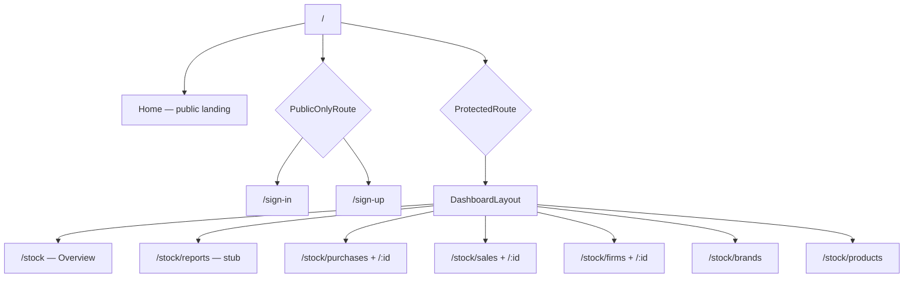

<div align="center">

# 📦 Smart Stock

### A full-featured inventory & stock management dashboard built with React 19

Track purchases, sales, products, brands and supplier firms from a single, fast, themeable control panel.

[](https://react.dev)
[](https://redux-toolkit.js.org)
[](https://reactrouter.com)
[](https://tailwindcss.com)
[](https://vite.dev)
[](https://ui.shadcn.com)
[](https://zod.dev)

**[🚀 Live Demo](#)** · **[🐛 Report Bug](#)** · **[💡 Request Feature](#)**

<!-- Replace the # links above with your deployment URL and repo issue links -->

</div>

---

## 📑 Table of Contents

- [About the Project](#-about-the-project)
- [Scope](#-scope)
- [Features](#-features)
- [Screenshots](#️-screenshots)
- [Tech Stack](#️-tech-stack)
- [Architecture](#️-architecture)
- [Folder Structure](#-folder-structure)
- [Getting Started](#-getting-started)
- [Available Scripts](#-available-scripts)
- [API Reference](#-api-reference)
- [Roadmap](#️-roadmap)
- [Contributing](#-contributing)
- [License](#-license)
- [Author](#-author)

---

## 🎯 About the Project

**Smart Stock** is a single-page inventory management application for small businesses and warehouse operations. It gives you one place to record what you buy, what you sell, and what is left on the shelf — with an analytics overview that turns those raw movements into readable numbers.

The app is built around a **feature-sliced architecture**: every domain (auth, stock, dashboard, home) owns its own pages, components, Redux slice, validation schemas and data-access hook. Nothing domain-specific leaks into the global `components/` folder, which keeps only generic, reusable UI.

It is a client-side application that talks to a hosted REST API. Authentication state survives page reloads via `redux-persist`, protected routes redirect unauthenticated visitors to sign-in, and every mutation re-syncs its resource so the UI never drifts from the server.

---

## 🔍 Scope

### ✅ What is included

| | |
|---|---|
| **Full CRUD** | Create, read, update and delete across Firms, Brands, Products, Purchases and Sales |
| **Authentication** | Sign-up, sign-in, sign-out with token-based auth and persisted sessions |
| **Route protection** | Guarded dashboard routes plus "public-only" guards that bounce signed-in users away from auth pages |
| **Analytics dashboard** | KPI cards and an interactive area chart derived from real sales and purchase data |
| **Advanced data tables** | Sorting, global search, per-column filtering, column visibility toggles, row selection and pagination |
| **Form validation** | Schema-driven validation on every form, client-side, before a request is ever sent |
| **Theming** | Light / dark / system modes with a flash-free, transition-suppressed switch |
| **Responsive shell** | Collapsible sidebar layout that adapts from desktop down to mobile |

### ⛔ What is out of scope

- **No backend in this repository.** The app is a pure frontend client and consumes a hosted REST API (see [API Reference](#-api-reference)). There is no server, database or migration code here.
- **No file uploads.** Images for brands and firms are supplied as URLs, validated by schema — not uploaded as binaries.
- **The `Reports` route is a deliberate placeholder.** It renders a "Working on it.." stub and is tracked in the [Roadmap](#️-roadmap).
- **Categories are read-only in the UI.** They are fetched and used to populate product forms, but there is no category management screen yet.
- **No automated test suite yet.** Also on the roadmap.

---

## ✨ Features

### 🔐 Authentication & Access Control

- Token-based sign-in and sign-up backed by Zod-validated forms
- Strong password policy enforced client-side: minimum 8 characters, with an uppercase letter, a lowercase letter, a digit and a special character
- `ProtectedRoute` guard — unauthenticated visitors hitting `/stock/*` are redirected to `/sign-in`
- `PublicOnlyRoute` guard — already-authenticated users are bounced off `/sign-in` and `/sign-up` back to the dashboard
- Session persistence through `redux-persist`, so a refresh never logs you out
- Toast feedback on every success and every failure, surfacing the API's own error message

### 📊 Analytics Dashboard

- KPI section cards computed from live sales and purchase data
- Interactive, range-switchable area chart built with Recharts
- Period-over-period comparison helpers: percentage change, percentage-point change and signed formatting
- Currency and number formatting via the native `Intl` API — no extra formatting dependency

### 📦 Stock Management

- **Firms** — supplier directory with a card grid, plus a detail view for each firm
- **Brands** — brand catalog with image previews in a card layout
- **Products** — table view joining category, brand and current stock quantity
- **Purchases** — record incoming inventory against a firm, brand and product, with a per-purchase detail page
- **Sales** — record outgoing inventory, with a per-sale detail page
- Modal-driven create and edit flows shared across all resources
- Confirmation dialogs guarding every destructive delete

### 🧮 Data Table Experience

Powered by TanStack Table v9's opt-in feature registration — only the features actually used are bundled:

- Multi-column sorting with alphanumeric and text comparators
- Global search across all columns, plus per-column filtering
- Column visibility dropdown
- Row selection
- Client-side pagination with page-size control

### 🎨 UI & Experience

- shadcn/ui components built on **Base UI** primitives, in the `base-luma` style with a `mist` base color
- Tailwind CSS v4 via the native Vite plugin — no PostCSS config to maintain
- Light / dark / system theme with a `prefers-color-scheme` listener that reacts to OS changes live
- Transitions are temporarily suppressed during a theme switch to avoid the color-flash effect
- Skeleton loaders for every async surface
- Public Sans variable font, self-hosted through Fontsource

---

## 🖼️ Screenshots

> **📌 Add your images here.** Drop your PNG files into `docs/screenshots/` using the exact filenames below and they will render automatically — no edits to this README required.

### Landing & Authentication

| Landing Page | Sign In |
|:---:|:---:|
|  |  |

| Sign Up | Error Page |
|:---:|:---:|
|  |  |

### Dashboard

| Overview — Dark | Overview — Light |
|:---:|:---:|
|  |  |

### Stock Modules

| Products Table | Firms Grid |
|:---:|:---:|
|  |  |

| Brands Grid | Purchases Table |
|:---:|:---:|
|  |  |

| Purchase Detail | Create / Edit Modal |
|:---:|:---:|
|  |  |

### Responsive

| Mobile Sidebar | Mobile Dashboard |
|:---:|:---:|
|  |  |

---

## 🛠️ Tech Stack

### Core

| Package | Version | Role |
|---|---|---|
| [`react`](https://react.dev) | `19.2` | UI library |
| [`react-dom`](https://react.dev) | `19.2` | DOM renderer |
| [`vite`](https://vite.dev) | `8` | Build tool and dev server |
| [`@vitejs/plugin-react`](https://github.com/vitejs/vite-plugin-react) | `6` | React Fast Refresh + JSX transform |
| [`react-router-dom`](https://reactrouter.com) | `7.18` | Data-router based client routing |

### State & Data

| Package | Version | Role |
|---|---|---|
| [`@reduxjs/toolkit`](https://redux-toolkit.js.org) | `2.12` | Store, slices, reducers |
| [`react-redux`](https://react-redux.js.org) | `9.3` | React bindings for Redux |
| [`redux-persist`](https://github.com/rt2zz/redux-persist) | `6.0` | Persists the auth slice to `localStorage` |
| [`axios`](https://axios-http.com) | `1.19` | HTTP client for all API calls |
| [`@tanstack/react-table`](https://tanstack.com/table) | `9.1` | Headless table engine (opt-in features) |
| [`date-fns`](https://date-fns.org) | `4.4` | Date parsing and formatting |

### UI & Styling

| Package | Version | Role |
|---|---|---|
| [`tailwindcss`](https://tailwindcss.com) | `4` | Utility-first CSS |
| [`@tailwindcss/vite`](https://tailwindcss.com/docs/installation/using-vite) | `4` | First-party Vite integration |
| [`shadcn`](https://ui.shadcn.com) | `4.18` | Component generator / registry CLI |
| [`@base-ui/react`](https://base-ui.com) | `1.7` | Unstyled, accessible primitives under shadcn |
| [`recharts`](https://recharts.org) | `3.8` | Charting library for the dashboard |
| [`lucide-react`](https://lucide.dev) | `1.31` | Primary icon set |
| [`react-icons`](https://react-icons.github.io/react-icons/) | `5.7` | Supplemental brand icons |
| [`class-variance-authority`](https://cva.style) | `0.7` | Type-safe component variants |
| [`clsx`](https://github.com/lukeed/clsx) | `2.1` | Conditional class names |
| [`tailwind-merge`](https://github.com/dcastil/tailwind-merge) | `3.6` | Conflict-free Tailwind class merging |
| [`tw-animate-css`](https://github.com/Wombosvideo/tw-animate-css) | `1.4` | Animation utilities for Tailwind v4 |
| [`@fontsource-variable/public-sans`](https://fontsource.org) | `5.3` | Self-hosted variable font |

### Forms & Validation

| Package | Version | Role |
|---|---|---|
| [`react-hook-form`](https://react-hook-form.com) | `7.85` | Performant, uncontrolled form state |
| [`zod`](https://zod.dev) | `4.4` | Schema definition and validation |
| [`@hookform/resolvers`](https://github.com/react-hook-form/resolvers) | `5.9` | Bridges Zod schemas into React Hook Form |

### Tooling

| Package | Version | Role |
|---|---|---|
| [`eslint`](https://eslint.org) | `10` | Linting (flat config) |
| [`eslint-plugin-react-hooks`](https://react.dev) | `7.1` | Rules of Hooks enforcement |
| [`eslint-plugin-react-refresh`](https://github.com/ArnaudBarre/eslint-plugin-react-refresh) | `0.5` | Fast Refresh safety rules |
| [`prettier`](https://prettier.io) | `3.8` | Code formatting |
| [`prettier-plugin-tailwindcss`](https://github.com/tailwindlabs/prettier-plugin-tailwindcss) | `0.8` | Automatic Tailwind class sorting |
| [`pnpm`](https://pnpm.io) | — | Package manager |

---

## 🏗️ Architecture

### Feature-sliced structure

The codebase is organized **by domain, not by file type**. Each feature under `src/features/` is a self-contained vertical slice:

```
features/<domain>/
├── components/        → components used only by this domain
├── pages/             → route-level entry points
├── <domain>Slice.js   → Redux state + selectors
├── use<Domain>.js     → data-access hook (all API calls)
└── schemas.js         → Zod validation schemas
```

`src/components/` holds **only** generic UI: shadcn primitives in `ui/`, the app shell in `layout/`, and cross-feature building blocks in `shared/`. If a component knows about firms or purchases, it lives in a feature folder.

### Data flow



Every mutation (`createStock`, `updateStock`, `deleteStock`) automatically re-fetches its resource on success, so the store is always a faithful mirror of the server. Loading state is tracked **per resource** rather than globally, via a `statusByResource` map — so the products table can be loading while the brands list is already rendered.

### Route tree



### State persistence

Only the `auth` slice is whitelisted for persistence. Stock data is intentionally **not** persisted — it is volatile server state and should be re-fetched on load rather than restored from a stale cache.

---

## 📁 Folder Structure

```
Stock-Management-App/
│
├── public/                          # Static assets served as-is
│
├── src/
│   ├── assets/                      # Bundled images and SVGs
│   │
│   ├── components/                  # Global, domain-agnostic UI only
│   │   ├── layout/                  # App shell
│   │   │   ├── app-sidebar.jsx      # Sidebar container
│   │   │   ├── nav-header.jsx       # Top bar + breadcrumbs
│   │   │   ├── nav-main.jsx         # Primary navigation (collapsible)
│   │   │   ├── nav-projects.jsx     # Secondary project links
│   │   │   ├── nav-secondary.jsx    # Support / feedback links
│   │   │   └── nav-user.jsx         # User menu + sign-out
│   │   │
│   │   ├── shared/                  # Cross-feature building blocks
│   │   │   ├── delete-alert.jsx     # Reusable delete confirmation
│   │   │   ├── Skeletons.jsx        # Loading placeholders
│   │   │   └── table/               # Data-table system
│   │   │       ├── column.jsx
│   │   │       ├── data-table.jsx
│   │   │       ├── data-table-column-header.jsx
│   │   │       ├── data-table-features.js    # TanStack v9 feature registry
│   │   │       └── data-table-pagination.jsx
│   │   │
│   │   ├── ui/                      # shadcn/ui primitives (on Base UI)
│   │   │   ├── alert-dialog.jsx     ├── field.jsx      ├── sheet.jsx
│   │   │   ├── avatar.jsx           ├── input.jsx      ├── sidebar.jsx
│   │   │   ├── badge.jsx            ├── label.jsx      ├── skeleton.jsx
│   │   │   ├── breadcrumb.jsx       ├── select.jsx     ├── table.jsx
│   │   │   ├── button.jsx           ├── separator.jsx  ├── toast.jsx
│   │   │   ├── card.jsx             ├── chart.jsx      └── tooltip.jsx
│   │   │   ├── checkbox.jsx         ├── collapsible.jsx
│   │   │   ├── dialog.jsx           └── dropdown-menu.jsx
│   │   │
│   │   └── theme-provider.jsx       # Light / dark / system theme context
│   │
│   ├── features/                    # Domain slices
│   │   ├── auth/
│   │   │   ├── components/          # signin-form, signup-form
│   │   │   ├── pages/               # sign-in, sign-up
│   │   │   ├── authSlice.js         # currentUser + token state
│   │   │   ├── schemas.js           # Zod sign-in / sign-up schemas
│   │   │   └── useAuth.js           # signIn / signUp / signOut
│   │   │
│   │   ├── dashboard/
│   │   │   ├── components/
│   │   │   │   ├── chart-area-interactive.jsx
│   │   │   │   ├── dashboard-layout.jsx   # Sidebar + outlet shell
│   │   │   │   └── section-cards.jsx      # KPI cards
│   │   │   ├── pages/               # overview-page, error-page
│   │   │   └── lib.js               # Analytics and formatting helpers
│   │   │
│   │   ├── home/
│   │   │   └── pages/Home.jsx       # Public marketing landing page
│   │   │
│   │   └── stock/                   # The core domain
│   │       ├── components/
│   │       │   ├── brand-card.jsx   ├── firm-modal.jsx     ├── purchase-modal.jsx
│   │       │   ├── brand-modal.jsx  ├── product-modal.jsx  └── sale-modal.jsx
│   │       │   ├── firm-alert.jsx   └── firm-card.jsx
│   │       ├── pages/
│   │       │   ├── brand-page.jsx      ├── purchase-page.jsx
│   │       │   ├── firm-page.jsx       ├── purchase-detail.jsx
│   │       │   ├── firm-detail.jsx     ├── sale-page.jsx
│   │       │   ├── product-page.jsx    └── sale-detail.jsx
│   │       ├── schemas.js           # Zod schemas for all 5 resources
│   │       ├── stockSlice.js        # Resources + per-resource status
│   │       └── useStock.js          # Full CRUD data-access layer
│   │
│   ├── hooks/
│   │   └── use-mobile.js            # Responsive breakpoint hook
│   │
│   ├── lib/
│   │   └── utils.ts                 # cn() class-merge helper
│   │
│   ├── state/
│   │   └── store.js                 # Store, persist config, root reducer
│   │
│   ├── App.jsx                      # Router definition + route guards
│   ├── index.css                    # Tailwind v4 entry + design tokens
│   └── main.jsx                     # Root render + providers
│
├── .env                             # VITE_BASE_URL
├── components.json                  # shadcn/ui configuration
├── eslint.config.js                 # ESLint flat config
├── jsconfig.json                    # Path alias for editor IntelliSense
├── vite.config.ts                   # Vite + Tailwind + @ alias
└── package.json
```

---

## 🚀 Getting Started

### Prerequisites

| Requirement | Version |
|---|---|
| [Node.js](https://nodejs.org) | `20.x` or higher |
| [pnpm](https://pnpm.io) | `9.x` or higher (recommended) |

Install pnpm if you do not have it:

```bash
npm install -g pnpm
```

### Installation

**1. Clone the repository**

```bash
git clone https://github.com/<your-username>/<your-repo>.git
cd <your-repo>
```

**2. Install dependencies**

```bash
pnpm install
```

**3. Configure environment variables**

Create a `.env` file in the project root:

```bash
VITE_BASE_URL=https://stock-api-js.fullstack.clarusway.com
```

> ⚠️ Vite only exposes variables prefixed with `VITE_` to the client. Restart the dev server after editing `.env`.

**4. Start the development server**

```bash
pnpm dev
```

The app will be available at **http://localhost:5173**.

**5. Create an account**

Open the app, click **Sign Up**, and register. You will be redirected into the dashboard automatically.

<details>
<summary><b>Using npm or yarn instead?</b></summary>

```bash
# npm
npm install
npm run dev

# yarn
yarn install
yarn dev
```

</details>

---

## 📜 Available Scripts

| Command | Description |
|---|---|
| `pnpm dev` | Start the Vite dev server with HMR |
| `pnpm build` | Type-check with `tsc -b`, then produce a production build in `dist/` |
| `pnpm preview` | Serve the production build locally for a final check |
| `pnpm lint` | Run ESLint across the project |

---

## 🔌 API Reference

The app consumes the **Clarusway Stock API**, configured through `VITE_BASE_URL`:

```
https://stock-api-js.fullstack.clarusway.com
```

All authenticated requests send the token in the `Authorization` header:

```http
Authorization: Token <your-token>
```

### Authentication

| Method | Endpoint | Description |
|---|---|---|
| `POST` | `/auth/login` | Sign in — returns `{ user, token }` |
| `POST` | `/users` | Register a new account |
| `GET` | `/auth/logout` | Invalidate the current token |

### Stock resources

The same generic contract applies to every resource, which is why a single `useStock` hook covers all of them:

| Method | Endpoint | Description |
|---|---|---|
| `GET` | `/{resource}` | List all records |
| `GET` | `/{resource}/{id}` | Fetch a single record |
| `POST` | `/{resource}` | Create a record |
| `PUT` | `/{resource}/{id}` | Update a record |
| `DELETE` | `/{resource}/{id}` | Delete a record |

Where `{resource}` is one of:

`categories` · `brands` · `firms` · `products` · `purchases` · `sales`

### Validation contracts

Client-side rules enforced by Zod before any request is sent:

| Resource | Rules |
|---|---|
| **Firm** | `name` 2–100 chars · `phone` 8–25 chars, digits/spaces/`()+-` only · `address` 10–300 chars · `image` valid URL |
| **Brand** | `name` 2–100 chars · `image` valid URL |
| **Product** | `categoryId`, `brandId`, `name` all required |
| **Purchase** | `firmId`, `brandId`, `productId`, `quantity`, `price` all required |
| **Sale** | `brandId`, `productId`, `quantity`, `price` all required |
| **Sign up** | `username` ≥ 3 · `firstName` / `lastName` 2–50 · valid `email` · `password` ≥ 8 with upper, lower, digit and special character |

---

## 🗺️ Roadmap

- [x] Token-based authentication with persisted sessions
- [x] Protected and public-only route guards
- [x] Full CRUD for firms, brands, products, purchases and sales
- [x] Analytics overview with KPI cards and an interactive chart
- [x] Advanced data tables (sort, filter, search, paginate, select)
- [x] Light / dark / system theming
- [ ] **Reports page** — currently a stub, needs exportable period reports
- [ ] Category management UI (categories are read-only today)
- [ ] Optimistic updates instead of refetch-after-mutate
- [ ] Migrate the data layer to RTK Query
- [ ] Low-stock threshold alerts
- [ ] CSV / PDF export for tables
- [ ] Unit and integration test suite (Vitest + Testing Library)
- [ ] Internationalization (i18n)

---

## 🤝 Contributing

Contributions, issues and feature requests are welcome.

1. Fork the repository
2. Create your branch — `git checkout -b feature/amazing-feature`
3. Commit your changes — `git commit -m "feat: add amazing feature"`
4. Push the branch — `git push origin feature/amazing-feature`
5. Open a Pull Request

Please run `pnpm lint` before submitting, and keep the feature-sliced structure intact — domain code belongs in `src/features/`, not in `src/components/`.

---

## 📄 License

Distributed under the MIT License. See `LICENSE` for more information.

---

## 👤 Author

**Ondia Academy**

- GitHub: [@your-username](https://github.com/)
- LinkedIn: [Ondia Academy](https://linkedin.com/)

<!-- Replace the links above with your actual profiles -->

---

## 🙏 Acknowledgements

- Built as part of the **Ondia Academy / Clarusway** full-stack development curriculum
- [shadcn/ui](https://ui.shadcn.com) and [Base UI](https://base-ui.com) for the component foundation
- [TanStack Table](https://tanstack.com/table) for the headless table engine
- [Lucide](https://lucide.dev) for the icon set
- [Shields.io](https://shields.io) for the badges

---

<div align="center">

**If you found this project useful, consider giving it a ⭐**

</div>
